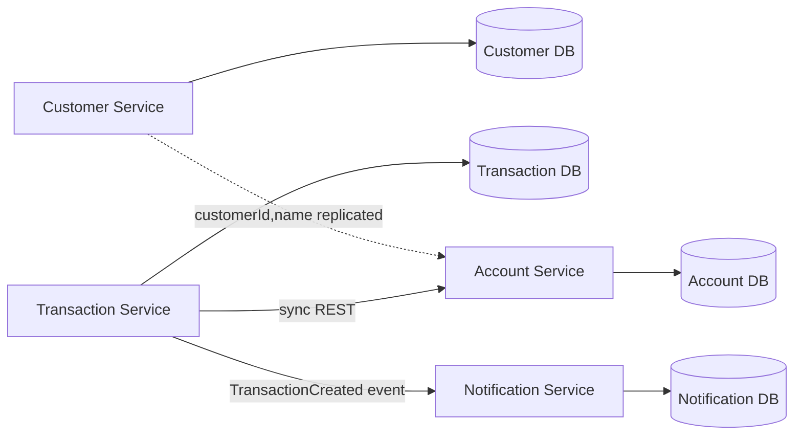
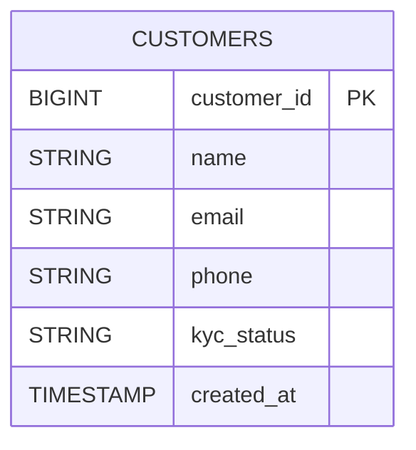
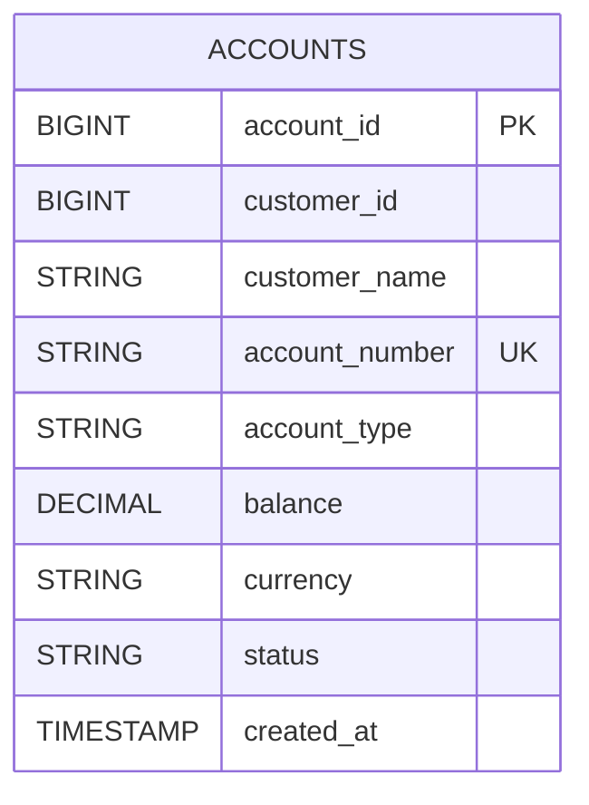
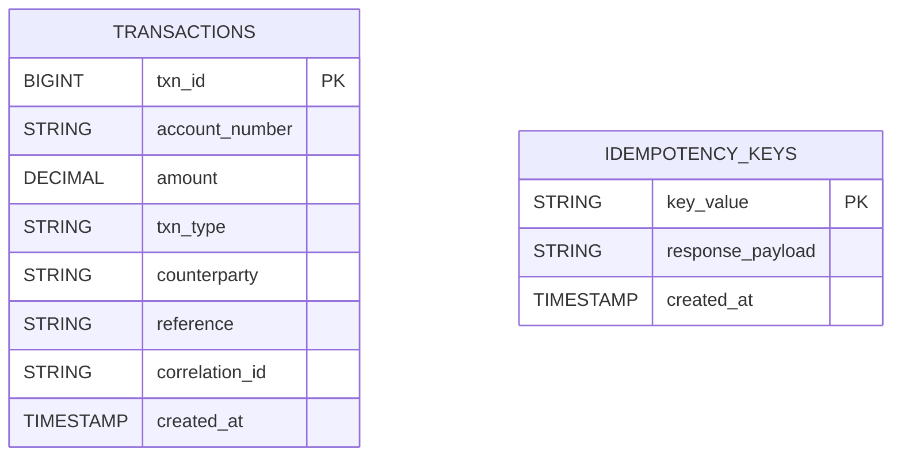
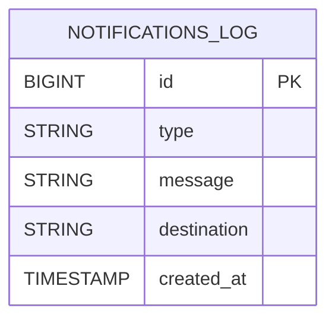

# Banking Microservices Assignment (Java)

This workspace contains **five publishable Git roots**: four application repositories (`customer-service`, `account-service`, `transaction-service`, `notification-service`) plus **`banking-infra`** for Docker Compose, Kubernetes, and CSV seeds. See [`banking-infra/REPOSITORIES.md`](banking-infra/REPOSITORIES.md) for how to split remotes on GitHub.

The optional root [`pom.xml`](pom.xml) only aggregates Maven modules for local convenience; **each service `pom.xml` already uses `spring-boot-starter-parent`**, so every service folder can be pushed as its own repo without the parent POM.

This project implements the banking assignment with **4 independent Java microservices** and **database-per-service** boundaries:

- `customer-service` (port `8081`) -> `customer_db`
- `account-service` (port `8082`) -> `account_db`
- `transaction-service` (port `8083`) -> `transaction_db`
- `notification-service` (port `8084`) -> `notification_db`

Each service has:
- Its own Spring Boot app, schema, and API
- OpenAPI/Swagger via `/swagger-ui/index.html`
- Health + metrics via `/actuator/health` and `/actuator/prometheus`

## 1) Service Responsibilities

### Customer Service
- CRUD customer profile
- KYC status management

### Account Service
- Create account, update account status
- Balance lookup
- Internal debit/credit APIs used by transfer workflow
- Prevent transactions for `FROZEN` and `CLOSED` accounts

### Transaction Service
- `/transactions/transfer` with `Idempotency-Key` header
- Creates both debit and credit transaction records
- Enforces:
  - no overdraft for `SAVINGS`
  - daily transfer limit `INR 200000`
  - retries with exponential backoff for account service calls
- Publishes `TransactionCreated` event to RabbitMQ

### Notification Service
- Consumes transaction events asynchronously
- Persists alert log in `notifications_log`
- Supports account-status notification endpoint

## 2) Context Map (Ownership + Replication)



## 3) ER Diagrams (per Service)

### Customer DB


### Account DB


### Transaction DB


### Notification DB


## 4) Local Run (Docker)

**Monorepo (this folder):**

```bash
docker compose up --build
```

**Multi-repo layout** (sibling clones): use [`banking-infra/docker-compose.yml`](banking-infra/docker-compose.yml) — build contexts are `../customer-service`, etc.

Check:
- `docker ps`
- `http://localhost:8081/actuator/health`
- `http://localhost:8082/actuator/health`
- `http://localhost:8083/actuator/health`
- `http://localhost:8084/actuator/health`

## 5) API Validation Flow

1. Create customer (Customer Service)
2. Create two accounts (Account Service)
3. Execute transfer:

```bash
curl -X POST http://localhost:8083/transactions/transfer \
  -H "Content-Type: application/json" \
  -H "Idempotency-Key: transfer-001" \
  -d '{"fromAccountNumber":"ACC1001","toAccountNumber":"ACC2001","amount":2500,"reference":"rent"}'
```

4. Verify statement:
```bash
curl http://localhost:8083/transactions/account/ACC1001/statement
```
5. Verify notification log:
```bash
curl http://localhost:8084/notifications
```

## 6) Minikube Deployment

Manifests (Postgres + RabbitMQ + PVCs + app Deployments/Services) live under **`banking-infra/k8s/`**.

Build images inside Minikube Docker daemon:
```bash
minikube start
minikube docker-env --shell powershell | Invoke-Expression
docker build -t customer-service:latest .\customer-service
docker build -t account-service:latest .\account-service
docker build -t transaction-service:latest .\transaction-service
docker build -t notification-service:latest .\notification-service
kubectl apply -f .\banking-infra\k8s\
```

Capture screenshots for:
- `kubectl get pods -n banking`
- `kubectl get svc -n banking`
- `kubectl logs deployment/transaction-service -n banking`

## 7) Monitoring

Implemented:
- RED/USE compatible HTTP metrics via Micrometer + Prometheus endpoint
- business counters/timers:
  - `customer_crud_total`
  - `balance_check_latency_ms`
- standard request rate/error/latency exposed through Actuator Prometheus

To complete dashboard requirement quickly:
- add Prometheus scrape config for all `/actuator/prometheus` endpoints
- add Grafana dashboard panels for p50/p90/p99, error rate, RPS

## 8) Seed Data

Generate CSVs:

```bash
cd banking-infra\seed-data
python generate_seed_csv.py
```

This writes assignment-shaped files plus `accounts_account_service_import.csv` and `transactions_transaction_service_import.csv` (see [`banking-infra/seed-data/README.md`](banking-infra/seed-data/README.md)). Root `seed-data/generate_seed_csv.py` delegates to the same generator.

Transfers between accounts are **INR-only** at runtime; seeded EUR/USD accounts are for data realism unless you add FX.

---

## Repository split (rubric)

Push **five** repositories:

| Repo | Path |
|------|------|
| Customer | `./customer-service` |
| Account | `./account-service` |
| Transaction | `./transaction-service` |
| Notification | `./notification-service` |
| Infra | `./banking-infra` |

PowerShell helper (initializes git in each folder): [`banking-infra/scripts/init-separate-repos.ps1`](banking-infra/scripts/init-separate-repos.ps1).
