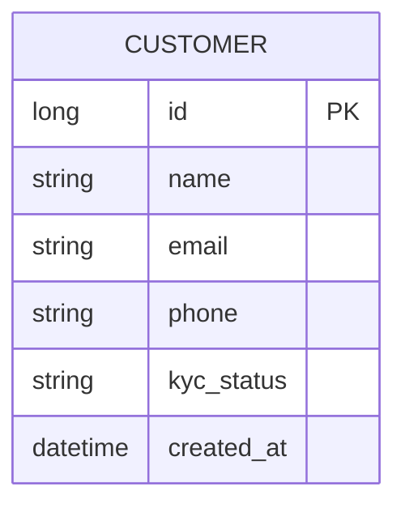
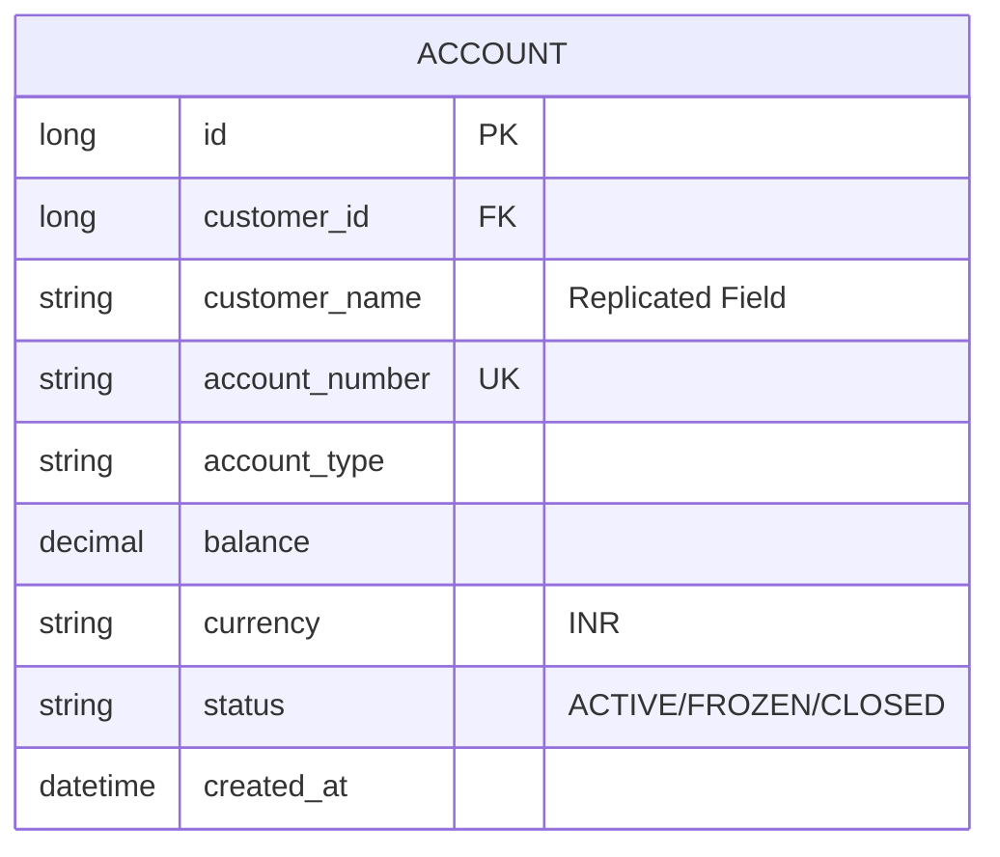
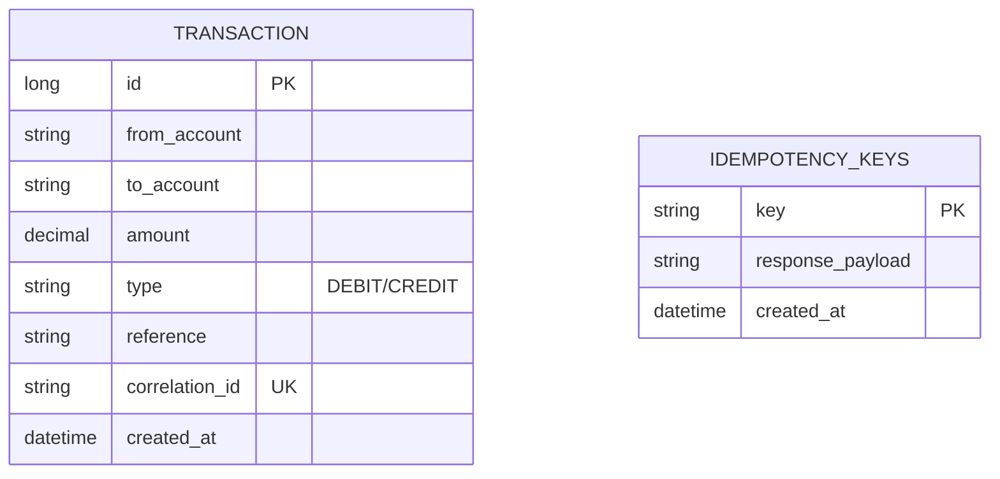
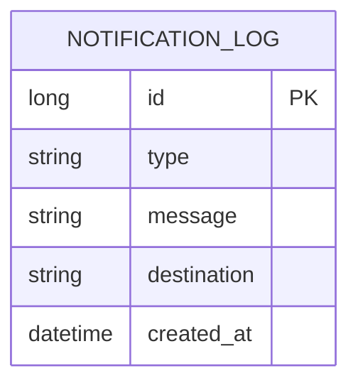

# Banking Microservices Platform

## Technical Documentation

**Scalable Services Project**

M.Tech 3rd Semester

---

**Submitted by:**

| Group Member | BITS ID |
|---|---|
| Kolla Naga Manasa | 2024TM93519 |
| Naseeruddin | 2024TM93510 |

---

**GitHub Links:**

- **Monorepo:** https://github.com/KollaNagaManasa/Group-5-Scalable-Services
- **Customer Service:** `./customer-service`
- **Account Service:** `./account-service`
- **Transaction Service:** `./transaction-service`
- **Notification Service:** `./notification-service`
- **Banking Infra:** `./banking-infra`

---

## Table of Contents

1. [Executive Summary](#1-executive-summary)
2. [System Architecture](#2-system-architecture)
3. [Microservices](#3-microservices)
4. [Database Design](#4-database-design)
5. [Features & Implementation](#5-features--implementation)
6. [Deployment Instructions](#6-deployment-instructions)
7. [Conclusion](#7-conclusion)

---

## 1. EXECUTIVE SUMMARY

This document presents the implementation of a comprehensive **Banking Microservices Platform** using microservices architecture. The system comprises four independent microservices (**Customer**, **Account**, **Transaction**, and **Notification**), each with its own PostgreSQL database following the **database-per-service** pattern. The platform manages the complete lifecycle of banking operations — from customer onboarding and account management through fund transfers and real-time notifications — with idempotency guarantees, business rule enforcement, and comprehensive observability. The implementation emphasises loose coupling, independent scalability, and service resilience through containerisation and orchestration technologies.

### Core Services

| Service | Port | Responsibility |
|---|---|---|
| Customer Service | 8081 | Customer profiles & KYC management |
| Account Service | 8082 | Account lifecycle, balance & debit/credit APIs |
| Transaction Service | 8083 | Fund transfers, idempotency, daily limits |
| Notification Service | 8084 | Async event-driven alerts & notification log |

### Technology Stack

| Layer | Technology |
|---|---|
| Backend | Java 21 with Spring Boot 3.3.2 |
| Database | PostgreSQL 16 (one per service) |
| Messaging | RabbitMQ 3 (with Management UI) |
| API Documentation | SpringDoc OpenAPI (Swagger UI) 2.6.0 |
| Containerisation | Docker (multi-stage builds) & Docker Compose |
| Orchestration | Kubernetes with Minikube |
| Monitoring | Spring Boot Actuator + Micrometer + Prometheus |
| Inter-Service Communication | Synchronous REST (RestTemplate) |
| Build Tool | Apache Maven 3.9.x |

---

## 2. SYSTEM ARCHITECTURE

```
┌─────────────────────────────────────────────────────────────────────┐
│                        BANKING PLATFORM                             │
│                                                                     │
│  ┌──────────────┐   ┌──────────────┐   ┌──────────────┐             │
│  │   Customer   │   │   Account    │   │ Transaction  │             │
│  │   Service    │◄──│   Service    │◄──│   Service    │             │
│  │   :8081      │   │   :8082      │   │   :8083      │             │
│  └──────┬───────┘   └──────┬───────┘   └──────┬───────┘             │
│         │                  │                  │                      │
│         │                  │                  │ publishes            │
│         │                  │                  ▼                      │
│         │                  │           ┌──────────────┐              │
│         │                  │           │   RabbitMQ   │              │
│         │                  │           │   :5672      │              │
│         │                  │           └──────┬───────┘              │
│         │                  │                  │ consumes             │
│         │                  │                  ▼                      │
│         │                  │           ┌──────────────┐              │
│         │                  │           │ Notification │              │
│         │                  │           │   Service    │              │
│         │                  │           │   :8084      │              │
│         │                  │           └──────┬───────┘              │
│         │                  │                  │                      │
│         ▼                  ▼                  ▼                      │
│  ┌────────────┐    ┌────────────┐    ┌──────────────┐  ┌──────────┐ │
│  │customer_db │    │account_db  │    │transaction_db│  │notif_db  │ │
│  │ Postgres   │    │ Postgres   │    │  Postgres    │  │ Postgres │ │
│  │ :5433      │    │ :5434      │    │  :5435       │  │ :5436    │ │
│  └────────────┘    └────────────┘    └──────────────┘  └──────────┘ │
└─────────────────────────────────────────────────────────────────────┘
```

### Context Map (Ownership & Replication)

```
Customer Service ──owns──► customer_db
       │
       │ customerId, name replicated via REST
       ▼
Account Service  ──owns──► account_db
       ▲
       │ sync REST (debit/credit)
       │
Transaction Service ──owns──► transaction_db
       │
       │ publishes TransactionCreated event (RabbitMQ)
       ▼
Notification Service ──owns──► notification_db
```

### Communication Patterns

| Pattern | From → To | Mechanism |
|---|---|---|
| Synchronous REST | Account → Customer | RestTemplate (`GET /customers/{id}`) |
| Synchronous REST | Transaction → Account | RestTemplate (`POST /accounts/internal/{acct}/debit\|credit`) |
| Asynchronous Messaging | Transaction → Notification | RabbitMQ (`txn.exchange` → `txn.notification.queue`) |

---

## 3. MICROSERVICES

### 3.1 Customer Service Endpoints

| Method | Endpoint | Description |
|---|---|---|
| `GET` | `/customers` | Get all customers |
| `POST` | `/customers` | Create a new customer |
| `GET` | `/customers/{id}` | Get customer by ID |
| `PUT` | `/customers/{id}` | Update customer profile |
| `PATCH` | `/customers/{id}/kyc` | Update KYC status |
| `DELETE` | `/customers/{id}` | Delete a customer |
| `GET` | `/actuator/health` | Health check |
| `GET` | `/actuator/prometheus` | Prometheus metrics |
| `GET` | `/swagger-ui/index.html` | Swagger API documentation |

### 3.2 Account Service Endpoints

| Method | Endpoint | Description |
|---|---|---|
| `GET` | `/accounts` | List all accounts |
| `POST` | `/accounts` | Create a new account |
| `GET` | `/accounts/{id}` | Get account by ID |
| `GET` | `/accounts/number/{accountNumber}` | Get account by account number |
| `PATCH` | `/accounts/{id}/status` | Update account status (ACTIVE/FROZEN/CLOSED) |
| `POST` | `/accounts/internal/{accountNumber}/debit` | Internal: Debit an account |
| `POST` | `/accounts/internal/{accountNumber}/credit` | Internal: Credit an account |
| `GET` | `/actuator/health` | Health check |
| `GET` | `/actuator/prometheus` | Prometheus metrics |
| `GET` | `/swagger-ui/index.html` | Swagger API documentation |

### 3.3 Transaction Service Endpoints

| Method | Endpoint | Description |
|---|---|---|
| `POST` | `/transactions/transfer` | Execute a fund transfer (requires `Idempotency-Key` header) |
| `GET` | `/transactions/account/{accountNumber}/statement` | Get account statement |
| `GET` | `/actuator/health` | Health check |
| `GET` | `/actuator/prometheus` | Prometheus metrics |
| `GET` | `/swagger-ui/index.html` | Swagger API documentation |

### 3.4 Notification Service Endpoints

| Method | Endpoint | Description |
|---|---|---|
| `GET` | `/notifications` | List all notification logs |
| `POST` | `/notifications/account-status` | Create account status notification |
| `GET` | `/actuator/health` | Health check |
| `GET` | `/actuator/prometheus` | Prometheus metrics |
| `GET` | `/swagger-ui/index.html` | Swagger API documentation |

### Service Summary

| Service | Responsibility & Key Endpoints |
|---|---|
| **Customer** | Manages: Customer profiles, KYC status. Endpoints: `POST/GET /customers`, `PATCH /customers/{id}/kyc` |
| **Account** | Manages: Account lifecycle, balance, debit/credit. Endpoints: `POST/GET /accounts`, `PATCH /accounts/{id}/status`, `POST /accounts/internal/{acct}/debit\|credit` |
| **Transaction** | Manages: Fund transfers, idempotency, daily limits, event publishing. Endpoints: `POST /transactions/transfer`, `GET /transactions/account/{acct}/statement` |
| **Notification** | Manages: Async alerts, notification log. Endpoints: `GET /notifications`, `POST /notifications/account-status`, RabbitMQ consumer |

---

## 4. DATABASE DESIGN

### Customer Service — Table: `customers`

| Field Name | Type | Constraints | Purpose |
|---|---|---|---|
| `customer_id` | BIGINT | PK, AUTO_INCREMENT | Unique identifier for customer |
| `name` | VARCHAR | NOT NULL | Customer full name |
| `email` | VARCHAR | — | Customer email address |
| `phone` | VARCHAR | — | Customer phone number |
| `kyc_status` | VARCHAR | — | KYC verification status |
| `created_at` | TIMESTAMP WITH TZ | DEFAULT NOW | Record creation timestamp |

### Account Service — Table: `accounts`

| Field Name | Type | Constraints | Purpose |
|---|---|---|---|
| `account_id` | BIGINT | PK, AUTO_INCREMENT | Unique identifier for account |
| `customer_id` | BIGINT | — | Owner customer (replicated from Customer Service) |
| `customer_name` | VARCHAR | — | Replicated customer name (denormalised) |
| `account_number` | VARCHAR | UNIQUE, NOT NULL | Unique account number (e.g. ACC1001) |
| `account_type` | VARCHAR | — | Account type (SAVINGS / CURRENT / SALARY) |
| `balance` | DECIMAL | DEFAULT 0 | Current account balance |
| `currency` | VARCHAR | DEFAULT 'INR' | Account currency |
| `status` | VARCHAR | DEFAULT 'ACTIVE' | Account status (ACTIVE / FROZEN / CLOSED) |
| `created_at` | TIMESTAMP WITH TZ | DEFAULT NOW | Record creation timestamp |

### Transaction Service — Table: `transactions`

| Field Name | Type | Constraints | Purpose |
|---|---|---|---|
| `txn_id` | BIGINT | PK, AUTO_INCREMENT | Unique transaction identifier |
| `account_number` | VARCHAR | NOT NULL | Account involved in transaction |
| `amount` | DECIMAL | NOT NULL | Transaction amount |
| `txn_type` | VARCHAR | NOT NULL | Transaction type (DEBIT / CREDIT) |
| `counterparty` | VARCHAR | — | Other party's account number |
| `reference` | VARCHAR | — | Payment reference/description |
| `correlation_id` | VARCHAR | — | Links paired debit & credit records |
| `created_at` | TIMESTAMP WITH TZ | DEFAULT NOW | Transaction timestamp |

### Transaction Service — Table: `idempotency_keys`

| Field Name | Type | Constraints | Purpose |
|---|---|---|---|
| `key_value` | VARCHAR | PK | Idempotency key (from request header) |
| `response_payload` | TEXT | — | Cached response for replay |
| `created_at` | TIMESTAMP WITH TZ | DEFAULT NOW | Key creation timestamp |

### Notification Service — Table: `notifications_log`

| Field Name | Type | Constraints | Purpose |
## 3. DATABASE DESIGN

### 3.1 Data Ownership & Replication
| Service | Primary Data | Replicated Data (Read Models) |
|---|---|---|
| **Customer** | Profiles, KYC | N/A |
| **Account** | Accounts, Status | `customer_name` (from Customer Service) |
| **Transaction**| Txn Records, Idempotency | N/A |
| **Notification**| Notification Logs | N/A |

### 3.2 Service ER Diagrams (Isolated)

#### Customer Service DB


#### Account Service DB


#### Transaction Service DB


#### Notification Service DB


---

## 4. FEATURES & BUSINESS RULES

### 4.1 Transaction Rules
- **Overdraft Prevention:** Checks `Account Service` before debiting. Returns 400 if balance < amount.
- **Daily Transfer Limit:** Enforces a maximum cumulative daily transfer of **₹2,00,000** per account.
- **Frozen Account Guard:** Transactions on accounts with status `FROZEN` or `CLOSED` are rejected.
- **Idempotency:** The `/transfer` endpoint requires an `Idempotency-Key` header to prevent duplicate processing of the same request.

### 4.2 Inter-Service Resilience
- **Timeouts & Retries:** Transaction-to-Account calls implement a **3-attempt retry policy** with **exponential backoff** (starting at 200ms).
- **Event-Driven Alerts:** High-value transactions trigger asynchronous messages to the Notification Service via RabbitMQ.

---

## 5. MICROSERVICES

### 5.1 Customer Management
- Create / Read / Update / Delete customer profiles
- KYC status management (`PATCH /customers/{id}/kyc?status=VERIFIED`)
- Custom Micrometer counter (`customer_crud_total`) tracks all CRUD operations

### 5.2 Account Management
- Create / Read accounts with automatic customer name replication from Customer Service
- Update account status (ACTIVE → FROZEN / CLOSED)
- Internal debit and credit APIs for use by Transaction Service
- **Business Rules:**
  - Prevents overdraft on SAVINGS and SALARY accounts
  - Blocks all transactions on FROZEN or CLOSED accounts

### 5.3 Transaction Management
- Fund transfer between INR accounts with dual-record bookkeeping (DEBIT + CREDIT entries)
- **Idempotency:** `Idempotency-Key` request header prevents duplicate transfers; replays cached response
- **Daily Transfer Limit:** Enforces INR 200,000 daily outbound limit per account
- **Currency Validation:** Only INR-to-INR transfers are supported
- **Retry with Exponential Backoff:** Account service calls retry up to 3 times (200ms → 400ms → 800ms)
- **Compensating Transaction:** If credit fails after debit, automatically reverses the debit
- **Event Publishing:** Publishes `TransactionCreated` event to RabbitMQ on success
- **Observability:** Custom metrics — `transactions_total`, `failed_transfers_total`, `balance_check_latency_ms`

### 5.4 Notification Management
- Asynchronously consumes `TransactionCreated` events from RabbitMQ
- **High-Value Transaction Alerts:** Automatically logs notifications for transactions ≥ INR 50,000
- Account status change notification endpoint
- Persists all alerts in `notifications_log` table

### Workflow of Execution

| Step | Source → Target | API Endpoint | Purpose |
|---|---|---|---|
| 1 | Client → Customer | `POST /customers` | Register customer |
| 2 | Client → Account | `POST /accounts` | Create accounts |
| 3 | Account → Customer | `GET /customers/{id}` | Replicate customer name |
| 4 | Client → Transaction | `POST /transactions/transfer` | Initiate transfer |
| 5 | Transaction → Account | `GET /accounts/number/{acct}` | Validate currency (INR check) |
| 6 | Transaction → Account | `POST /accounts/internal/{acct}/debit` | Debit sender |
| 7 | Transaction → Account | `POST /accounts/internal/{acct}/credit` | Credit receiver |
| 8 | Transaction → RabbitMQ | Publish to `txn.exchange` | Emit event |
| 9 | RabbitMQ → Notification | Consume from `txn.notification.queue` | Log alert |

### App Flow

```
1. Register Customer        (Customer Service – POST /customers)
        ↓
2. Create Account            (Account Service – POST /accounts)
        ↓
3. Replicate Customer Name   (Account Service → Customer Service – GET /customers/{id})
        ↓
4. Initiate Transfer         (Transaction Service – POST /transactions/transfer)
        ↓
5. Validate INR Currency     (Transaction Service → Account Service – GET /accounts/number/{acct})
        ↓
6. Enforce Daily Limit       (Transaction Service – local DB query)
        ↓
7. Debit Sender Account      (Transaction Service → Account Service – POST /internal/{acct}/debit)
        ↓
8. Credit Receiver Account   (Transaction Service → Account Service – POST /internal/{acct}/credit)
        ↓
9. Publish Event             (Transaction Service → RabbitMQ – TransactionCreated)
        ↓
10. Log Notification         (Notification Service – consumes event, persists alert)
        ↓
11. Verify Statement         (GET /transactions/account/{acct}/statement)
```

---

## 6. DEPLOYMENT INSTRUCTIONS

### 6.1 Docker Compose

**Step 1: Install Docker**
```bash
docker --version
```

**Step 2: Start All Services (Monorepo)**
```bash
docker compose up --build
```

**Step 3: Check Containers**
```bash
docker ps
```
Expected: 9 containers (4 services + 4 PostgreSQL + 1 RabbitMQ)

**Step 4: Verify Health**
```bash
curl http://localhost:8081/actuator/health
curl http://localhost:8082/actuator/health
curl http://localhost:8083/actuator/health
curl http://localhost:8084/actuator/health
```

### 6.2 Kubernetes (Minikube)

**Step 1: Start Minikube**
```bash
minikube start --cpus=4 --memory=8192
```

**Step 2: Build Images Inside Minikube Docker Daemon**
```powershell
minikube docker-env --shell powershell | Invoke-Expression

docker build -t customer-service:latest .\customer-service
docker build -t account-service:latest .\account-service
docker build -t transaction-service:latest .\transaction-service
docker build -t notification-service:latest .\notification-service
```

**Step 3: Deploy Manifests**
```bash
kubectl apply -f .\banking-infra\k8s\
```

**Step 4: Verify Deployment**
```bash
kubectl get pods -n banking
kubectl get svc -n banking
kubectl logs deployment/customer-service -n banking
kubectl logs deployment/transaction-service -n banking
```

**Step 5: Access Services via NodePort**

| Service | NodePort URL |
|---|---|
| Customer Service | `http://<minikube-ip>:30081` |
| Account Service | `http://<minikube-ip>:30082` |
| Transaction Service | `http://<minikube-ip>:30083` |
| Notification Service | `http://<minikube-ip>:30084` |

Get Minikube IP:
```bash
minikube ip
```

### 6.3 Kubernetes Manifests Overview

| File | Contents |
|---|---|
| `00-namespace-config-secret.yaml` | `banking` namespace, ConfigMap (service URLs), Secrets (DB passwords) |
| `10-datastores.yaml` | 4× PostgreSQL Deployments + Services + PVCs, 1× RabbitMQ Deployment + Service |
| `20-apps.yaml` | 4× Application Deployments + NodePort Services (with readiness/liveness probes, resource limits) |

---

## 7. API VALIDATION FLOW

### Step 1: Create Customer
```bash
curl -X POST http://localhost:8081/customers \
  -H "Content-Type: application/json" \
  -d '{"name":"Ravi Kumar","email":"ravi@example.com","phone":"9876543210","kycStatus":"VERIFIED"}'
```

### Step 2: Create Accounts
```bash
curl -X POST http://localhost:8082/accounts \
  -H "Content-Type: application/json" \
  -d '{"customerId":1,"accountNumber":"ACC1001","accountType":"SAVINGS","balance":100000,"currency":"INR"}'

curl -X POST http://localhost:8082/accounts \
  -H "Content-Type: application/json" \
  -d '{"customerId":1,"accountNumber":"ACC2001","accountType":"CURRENT","balance":50000,"currency":"INR"}'
```

### Step 3: Execute Transfer
```bash
curl -X POST http://localhost:8083/transactions/transfer \
  -H "Content-Type: application/json" \
  -H "Idempotency-Key: transfer-001" \
  -d '{"fromAccountNumber":"ACC1001","toAccountNumber":"ACC2001","amount":2500,"reference":"rent"}'
```

### Step 4: Verify Statement
```bash
curl http://localhost:8083/transactions/account/ACC1001/statement
```

### Step 5: Verify Notifications
```bash
curl http://localhost:8084/notifications
```

---

## 8. MONITORING & OBSERVABILITY

### Health Endpoints
Each service exposes Spring Boot Actuator health endpoints:
- `GET /actuator/health` — Service health status
- `GET /actuator/prometheus` — Prometheus-compatible metrics

### Custom Business Metrics

| Metric | Service | Type | Description |
|---|---|---|---|
| `customer_crud_total` | Customer | Counter | Total CRUD operations on customers |
| `transactions_total` | Transaction | Counter | Total successful transfers |
| `failed_transfers_total` | Transaction | Counter | Total failed transfer attempts |
| `balance_check_latency_ms` | Transaction | Timer | Latency of account service calls |

### Swagger/OpenAPI Documentation
Each service provides interactive Swagger UI for testing:
- **Customer:** `http://localhost:8081/swagger-ui/index.html`
- **Account:** `http://localhost:8082/swagger-ui/index.html`
- **Transaction:** `http://localhost:8083/swagger-ui/index.html`
- **Notification:** `http://localhost:8084/swagger-ui/index.html`

---

## 9. DETAILED CURL COMMANDS

### Customer Service
**Health Check:**
```bash
curl http://localhost:8081/actuator/health
```
**Create Customer:**
```bash
curl -X POST http://localhost:8081/customers -H "Content-Type: application/json" -d '{"name":"John Doe","email":"john@example.com","phone":"9988776655","kycStatus":"PENDING"}'
```
**Update KYC:**
```bash
curl -X PATCH "http://localhost:8081/customers/1/kyc?status=VERIFIED"
```

### Account Service
**Create Account:**
```bash
curl -X POST http://localhost:8082/accounts -H "Content-Type: application/json" -d '{"customerId":1,"accountNumber":"ACC8899","accountType":"SAVINGS","balance":50000}'
```
**Check Balance:**
```bash
curl http://localhost:8082/accounts/number/ACC8899
```

### Transaction Service
**Execute Transfer:**
```bash
curl -X POST http://localhost:8083/transactions/transfer \
  -H "Content-Type: application/json" \
  -H "Idempotency-Key: unique-key-123" \
  -d '{"fromAccountNumber":"ACC1001","toAccountNumber":"ACC2001","amount":1000,"reference":"Gift"}'
```
**Get Statement:**
```bash
curl http://localhost:8083/transactions/account/ACC1001/statement
```

### Notification Service
**View Logs:**
```bash
curl http://localhost:8084/notifications
```

---

## 10. SCREENSHOTS & VERIFICATION

### 10.1 Service Health & Actuator
*(Insert Screenshot: Browser/Postman showing /actuator/health for all 4 services)*

### 10.2 Swagger Documentation
*(Insert Screenshot: Swagger UI for Transaction Service showing transfer endpoint)*

### 10.3 Postman Execution
*(Insert Screenshot: Postman showing a successful transfer response with Idempotency-Key)*

### 10.4 Database State
*(Insert Screenshot: pgAdmin or terminal showing transaction_db records after a transfer)*

### 10.5 Kubernetes Pods & Services
*(Insert Screenshot: Output of `kubectl get pods,svc -n banking` showing all running instances)*

---

## 11. CONCLUSION

This Banking Microservices Platform demonstrates a production-grade microservices implementation with:

- **Service Isolation:** Four independent services, each with its own database, codebase, and deployment lifecycle.
- **Database-per-Service:** PostgreSQL 16 instances ensure strict bounded contexts with no shared tables.
- **Asynchronous Communication:** RabbitMQ enables event-driven notifications without tight coupling.
- **Resilience Patterns:** Idempotency keys, exponential backoff retries, and compensating transactions.
- **Business Rule Enforcement:** Overdraft prevention, daily transfer limits, and frozen account guards.
- **Comprehensive Observability:** Actuator health checks, Prometheus metrics, and custom business timers.
- **Container-Ready:** Multi-stage Docker builds and production-grade Kubernetes manifests.

The platform is designed for growth, extensibility, and high-scale banking operations.
